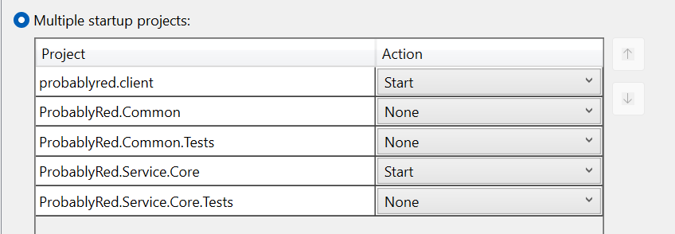

# probably-red

Foundation framework for a probability calculator

## Notes

### Startup

Client and server currently being launched via VS with the following configuration

### Logs

ProbablyRed.Service.Core is the Web API project saving logs to the project root
_eg ...ProbablyRed\ProbablyRed.Service.Core\Logs\log-\*.txt_

## ToDo

- [ ] Camalcase all response type and handle dynamic input property setting
- [ ] Allow for dynamic result instead of just decimal
- [x] Create typescript types
- [ ] Add client side cypress tests
- [x] Move all urls to env or setting files
- [x] Add error output
- [ ] Build pipeline required windows. Suspect its client folder casing issue **(Investigate)**

## Improvements

- [ ] Add Tailwind
- [ ] Add Storybook
- [x] Add Github CI
- [ ] Add Github CD
